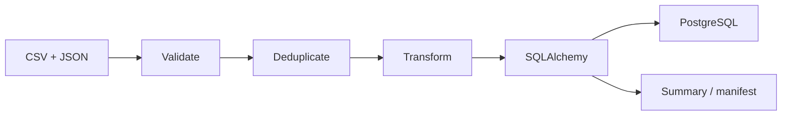

# Data ETL Automation Lab

Independent public portfolio project for **Python**, **ETL automation**, **PostgreSQL**, **SQLAlchemy** and **Docker**.

This repository was created from scratch with fictional devices and synthetic event data. It does not contain corporate code, real data, private endpoints, credentials, logs or proprietary rules.

## Problem

Operational datasets often need validation, deduplication, transformation, relational loading and auditable summaries.

## What It Demonstrates

- CSV event ingestion.
- JSON lookup data.
- Validation for unknown devices, invalid statuses and invalid metrics.
- Deduplication by `event_id`.
- Transformation into a normalized event table with a synthetic health score.
- SQLAlchemy persistence.
- PostgreSQL runtime with Docker Compose.
- Summary, invalid-record output and manifest generation.

## Architecture



See [docs/architecture.md](docs/architecture.md) and [docs/adr/0002-postgresql-sqlalchemy-etl.md](docs/adr/0002-postgresql-sqlalchemy-etl.md).

## Stack

`Python` `CSV` `JSON` `SQLAlchemy` `PostgreSQL` `Docker Compose` `PyTest`

## Run With Docker

```powershell
copy .env.example .env
docker compose up --build
```

Generated files are written to `data/generated/`.

## Run Locally

```powershell
python -m pip install -e .
python examples/run_demo.py
```

Without `DATABASE_URL`, the local demo writes to SQLite under `data/generated/`. Docker Compose uses PostgreSQL.

## Run Tests

```powershell
python -m pip install -e ".[dev]"
pytest
```

## Technical Decisions

- PostgreSQL is used because ETL output is relational and queryable.
- SQLAlchemy keeps the load step explicit and portable for tests.
- Docker Compose is used because the pipeline has an application container and a database service.
- SQLite remains useful for fast feedback and does not replace the PostgreSQL runtime.

## Roadmap

- Add richer batch manifests after the PyTest study phase.
- Add migration tooling when schema evolution becomes frequent.
- Add optional aggregate reports by group and status.

## Security and Independence

See [SECURITY.md](SECURITY.md) and [DISCLAIMER.md](DISCLAIMER.md).
