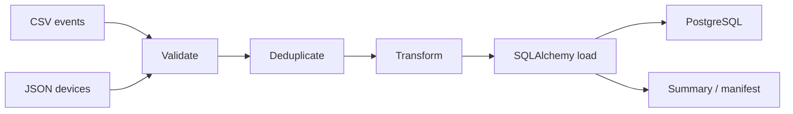

# Data ETL Automation Lab

[](https://github.com/guilherme-lacerda-tech/data-etl-automation-lab/actions/workflows/ci.yml)

[](https://github.com/guilherme-lacerda-tech/data-etl-automation-lab/releases)
[](LICENSE)

Synthetic ETL pipeline that validates CSV and JSON inputs, deduplicates records, loads SQLAlchemy models and writes auditable reports.

## Why / Problem

Data workflows need clear validation, repeatable transformations and a way to explain what happened in each batch. This lab demonstrates that pattern with synthetic operational records.

## Features

- CSV event ingestion and JSON device lookup.
- Validation for unknown devices, invalid status, invalid metrics and missing IDs.
- Deduplication by `event_id`.
- Transformation with synthetic `health_score`.
- SQLAlchemy persistence.
- PostgreSQL runtime through Docker Compose.
- Summary, invalid-record report and manifest.
- Synthetic time and memory benchmark for larger local batches without requiring Docker.
- CI with Ruff, PyTest and coverage.

## Architecture



## Tech Stack

Current: `Python` `CSV` `JSON` `SQLAlchemy` `PostgreSQL` `Docker Compose` `PyTest` `Ruff`

Planned: richer batch manifests, aggregate reports and migration tooling if schema changes become frequent.

## Quick Start

```powershell
python -m pip install -e ".[dev]"
python examples/run_demo.py
```

Without `DATABASE_URL`, the local demo uses SQLite under `data/generated/`. Docker Compose uses PostgreSQL.

## Docker

```powershell
copy .env.example .env
docker compose up --build
```

Docker runtime validation requires a local Docker CLI. In this workspace the Docker CLI was unavailable, so the Compose configuration was reviewed and the Python test/demo validation was executed separately.

## Tests

```powershell
python -m pytest --cov --cov-report=term-missing
python -m ruff check .
```

## Example Output

```json
{
  "records_received": 7,
  "valid_records": 4,
  "invalid_records": 2,
  "duplicated_records": 1,
  "processed_records": 4
}
```

## Project Structure

- `src/data_etl_automation_lab/pipeline.py`: validation, deduplication, transformation and load.
- `src/data_etl_automation_lab/models.py`: SQLAlchemy models.
- `data/sample`: synthetic source data.
- `tests`: validation, transformation, manifest and load tests.

## Engineering Decisions

- PostgreSQL is used because loaded ETL state is relational and queryable.
- SQLite remains useful for fast local tests.
- Invalid rows are reported separately so the batch result is inspectable.

See [docs/adr/0002-postgresql-sqlalchemy-etl.md](docs/adr/0002-postgresql-sqlalchemy-etl.md).

## Roadmap

See [ROADMAP.md](ROADMAP.md).

## Security

All datasets are synthetic. No real logs, customer identifiers, internal paths, private endpoints or credentials are included.
