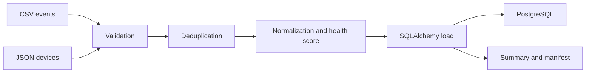

# Architecture

## Design Goal

Demonstrate a reproducible ETL pipeline using only synthetic CSV and JSON inputs.

## Pipeline

## Metrics

The pipeline reports received, valid, invalid, duplicate and processed record counts. Invalid rows are written separately so the batch result is auditable.

## Boundaries

- All records are synthetic.
- PostgreSQL is the intended runtime database.
- SQLite is used only for tests and quick local execution.
- Output files are generated under ignored folders.
